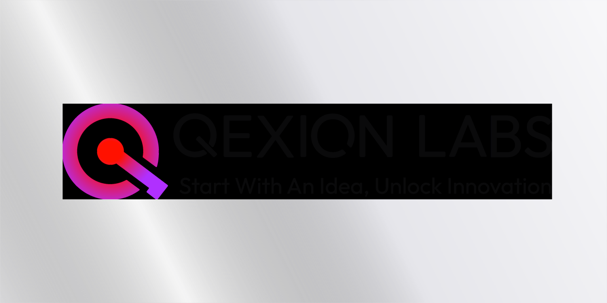

## 👋 Welcome to QEXION Labs

We are a **Technology Innovation Lab** dedicated to transforming bold ideas into breakthrough solutions. Through our unique blend of technical expertise, creative innovation, and strategic insight, we bridge the gap between concept and reality.

**Our Philosophy:** Every great innovation starts with a connection—between an idea and its potential, between technology and human need, between today's challenges and tomorrow's solutions.

### 🎯 What We Do

**Multi-Stream Development Approach:**

- 🚀 **SaaS Products** - Scalable software solutions that solve real problems
- 🛠️ **Custom Development** - Bespoke technology tailored to unique requirements
- 🎓 **Consulting Services** - Strategic guidance from concept to deployment
- 🔬 **R&D Projects** - Cutting-edge research pushing technological boundaries
- 🌐 **Community Building** - Fostering creative ecosystems and collaboration

---

## 🌟 Featured Projects

### 🎯 Projectify - Academic Excellence

**Comprehensive development consultation for computer science students**

- End-of-year project development and documentation
- Assignment assistance and personal project guidance
- GitHub setup, README generation, and development workflows
- AI automation tools and consultation for modern development

### 🎮 Q-Hangout - Community Innovation

**Discord-based developer community and learning platform**

- Help channels for CS students and developers
- Project showcases and peer collaboration
- Course marketplace for educators and professionals
- Growing to become Africa's largest developer community

### 🔬 Classified R&D

**Breakthrough projects under development**

- Advanced AI integration
- Novel user experience paradigms
- Proprietary technology innovations

---

## 🛠️ Technology Excellence

**Our Tech Stack:**

```yaml
Frontend     │ React, Next.js, TypeScript, Tailwind CSS
Backend      │ Node.js, Python, PHP, PostgreSQL, MongoDB
AI/ML        │ OpenAI, Anthropic, Custom Model Training
DevOps       │ Docker, AWS, GitHub Actions, VS Code
Design       │ Figma, Adobe Creative Suite, Custom Design Systems
Tools        │ MCP Servers, AI-Assisted Development, Rapid Prototyping
```

**Development Philosophy:**

- 🤖 **AI-First Development** - Leveraging cutting-edge AI tools for enhanced productivity
- 🎨 **Poet-Coder Approach** - Balancing technical precision with creative expression
- 🔄 **Rapid Prototyping** - Fast iteration and continuous improvement
- 🌍 **Community Impact** - Building solutions that serve real needs

---

## 🚀 Get Involved

### 🤝 For Students & Developers

- 📚 **Projectify:** Academic project consultation (launching September 1st)
- 💬 **Q-Hangout:** Join our Discord developer community (launching September 1st)
- 🤝 **Collaborate:** Work with us on open source projects

### 💼 For Businesses

- 🛠️ **Custom Development:** Websites, applications, and automation solutions
- 💡 **Technology Consulting:** AI integration and workflow optimization
- 🤝 **Partnership:** Collaborate on meaningful technology projects

### 🎓 For Educators

- 📖 **Course Marketplace:** Sell courses through Q-Hangout (coming soon)
- 🎯 **Academic Partnerships:** Collaborate with our Projectify initiative
- 🌍 **Community Building:** Help us grow Africa's largest developer community

---

## 🏗️ Organizational Excellence

**Departments:**

- 🎨 **Q-Brand** - Creative & Design Innovation
- 💻 **Q-Dev** - Development & Engineering Excellence
- 📊 **Q-Business** - Operations & Strategic Growth
- 🔍 **Q-Intelligence** - Research & Market Analysis
- 👤 **Q-Profile** - Knowledge Management & Learning

**Development Methodology:**

1. **Ideation** - Identify breakthrough opportunities
2. **Connection** - Link concepts to technical possibilities
3. **Prototyping** - Rapid development and testing
4. **Refinement** - Iterative improvement and optimization
5. **Scale** - Strategic deployment and growth

---

## 🌐 Connect With Us

### Primary Channels

- 📧 **Email:** [hello@qexionlabs.com](mailto:hello@qexionlabs.com)
- 💼 **LinkedIn:** [/company/qexion-labs](https://linkedin.com/company/qexion-labs)
- 🐦 **Twitter:** [@qexionlabs](https://twitter.com/qexionlabs)

### Community

- 💬 **Discord:** Q-Hangout Community (launching September 1st)
- � **Updates:** Follow our journey as we build something extraordinary

---

## � Our Approach

**Quality Standards:**

- 🔒 **Security-First** development practices
- 🌍 **Ethical Technology** development with human impact in mind
- 📚 **Open Source** contribution and community building
- ♿ **Accessibility** focused design and development
- 🌱 **Sustainable** technology practices

**Our Commitment:**

We're building something real, something meaningful. Starting in Ghana with Valley View University, growing across Africa, and eventually reaching developers worldwide. No fake awards or inflated metrics—just genuine innovation and community impact.

---

## 📄 Community Guidelines

- 📋 [Code of Conduct](https://github.com/qexion-labs/.github/blob/main/CODE_OF_CONDUCT.md)
- 🔒 [Security Policy](https://github.com/qexion-labs/.github/blob/main/SECURITY.md)
- 🤝 [Contributing Guidelines](https://github.com/qexion-labs/.github/blob/main/CONTRIBUTING.md)

---

## ⚡ "Start With An Idea, Unlock Innovation"

**Built with ❤️ by the QEXION LABS Team**

**Transforming Ideas into Innovation • One Project at a Time**

---

**Want to create your own organization README?** Check out [GitHub's guide](https://docs.github.com/en/organizations/collaborating-with-groups-in-organizations/customizing-your-organizations-profile) to get started.
