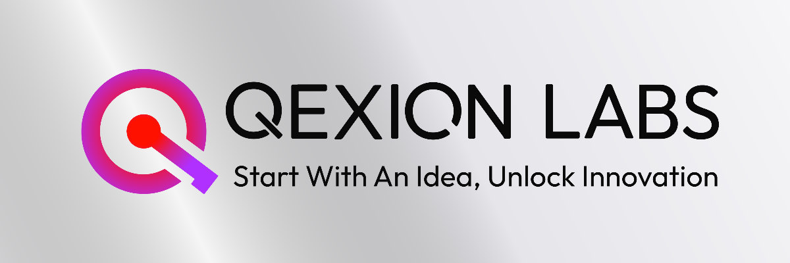

<div align="center">

# QEXION LABS

### _Start With An Idea, Unlock Innovation_

**Technology Innovation Company** • **Founded October 2025** • **Global Impact from Ghana**

[](https://qexionlabs.com)
[](https://qexionlabs.com/services/projectify)
[](https://qexionlabs.com/about)
[](mailto:hello@qexionlabs.com)

</div>

---

## About US

<table>
<tr>
<td align="center" width="50%">

### **Our Mission** 🎯

We transform breakthrough ideas into reality, creating innovative solutions that enhance human experience and solve critical challenges through advanced technology.

_Impactful Software Solutions_

</td>
<td align="center" width="50%">

### **Our Vision** 🌍

To become a leading technology innovation company creating solutions that fundamentally improve how humans live, work, and connect in the digital age.

_Global Innovation Leadership_

</td>
</tr>
</table>

<div align="center">

### **Breaking New Ground** 🔬

Our most ambitious project addresses a **fundamental aspect of human experience**. The foundations are being laid today, and the **footprints of tomorrow** are already appearing.

</div>

---

## 💼 **What We Build**

<div align="center">

### 🛠️ **Custom Development Services**

- **Professional Websites & Applications** - Modern, scalable solutions for businesses and institutions
- **Technology Consulting** - AI workflow optimization and digital transformation strategies
- **Advanced Automation** - Cutting-edge implementations using the latest technology
- **Enterprise Solutions** - Comprehensive systems for organizations and educational institutions

### 🎓 **Educational Initiatives**

- **[Projectify](https://qexionlabs.com/services/projectify)** - Academic project development consultation for computer science students
- **Development Workshops** - GitHub setup, README generation, and modern development workflows
- **AI Integration Training** - Consultation on AI automation tools and next-generation development practices
- **Academic Partnerships** - Collaboration with universities and educational institutions

### 🔬 **Innovation Lab Projects**

- **Breakthrough Technology Development** - Proprietary solutions addressing critical human challenges
- **R&D Initiatives** - Long-term projects focused on transformative technological solutions
- **Community Ecosystems** - Building platforms that foster creative collaboration
- **Experimental Technologies** - Cutting-edge approaches to fundamental technological problems

---

## 👨‍💻 **Leadership & Vision**

<div align="center">

### **Edward King Quintin-Sey**

**Founder & CEO**

_"Life is Code, Let's solve it together"_

[](https://linkedin.com/in/edward-quintin-sey)
[](https://quintin.engineer)

</div>

---

## 📊 **Company Highlights and Stats**

---

## 🛠️ **Our Technology Stack**

<div align="center">

### **Frontend & UI**


### **Backend & Database**


### **Cloud & Tools**


</div>

---

## ⚡ **Technology Excellence**

**Development Philosophy:**

- 🤖 **Smart Development** - Leveraging cutting-edge AI tools for enhanced productivity
- 🎨 **Design Excellence** - Balancing technical precision with creative expression and user experience
- 🔄 **Rapid Prototyping** - Fast iteration cycles and continuous improvement methodologies
- 🌍 **Global Impact Focus** - Building solutions that serve real human needs worldwide
- 🔒 **Security Excellence** - Implementing enterprise-grade security practices from the foundation

---

## 🏗️ **Organizational Excellence**

### **Q-Department Structure**

<div align="center">

| Department            | Focus Area                           | Innovation Stream                          |
| --------------------- | ------------------------------------ | ------------------------------------------ |
| 🎨 **Q-Brand**        | Creative & Design Excellence         | Visual Identity & Brand Strategy           |
| 💻 **Q-Dev**          | Development & Engineering Excellence | Technical Architecture & Implementation    |
| 📊 **Q-Business**     | Operations & Strategic Growth        | Business Development & Client Success      |
| 🔍 **Q-Intelligence** | Research & Market Analysis           | Market Research & Competitive Intelligence |

</div>

---

## 🤝 **Get Involved**

### **For Students & Developers**

```bash
# Explore Academic Services
curl https://qexionlabs.com/services/projectify

# Join Development Community
git clone projects && cd solutions

# Collaborate on Open Source
echo "Ready to innovate together?" | contribute
```

### **For Businesses & Organizations**

```bash
# Request Custom Development
POST /api/consultation
{
  "project_type": "custom_development",
  "solution_level": "advanced_systems"
}

# Technology Consultation
GET /services/consulting?focus=ai_integration
```

---

## 🌟 **Quality & Innovation Standards**

<div align="center">

### **Excellence Pillars**

| 🔒 **Security**                     | 🌍 **Ethics**                    | 📚 **Community**          | ♿ **Accessibility**            |
| ----------------------------------- | -------------------------------- | ------------------------- | ------------------------------- |
| Enterprise-grade security practices | Responsible development approach | Open source contributions | Universal design principles     |
| Security-first implementation       | Meaningful human impact focus    | Knowledge sharing culture | Inclusive development standards |

</div>

**Our Commitment:**

> We're building something real, something meaningful. Starting in Ghana, growing across Africa, and eventually reaching the global market with solutions that truly matter.

---

## 🌐 **Connect & Collaborate**

<div align="center">

### **Primary Channels**

[](https://qexionlabs.com)
[](https://qexionlabs.com/about)
[](https://qexionlabs.com/services/projectify)

### **Business Inquiries**

[](mailto:hello@qexionlabs.com)
[](https://linkedin.com/company/qexion-labs)

</div>

---

### **QEXION LABS**

_Technology Innovation Company • Established 2025_

**Building breakthrough solutions that enhance human experience through advanced technology**

<div align="center">

**🎯 Current Focus**: Academic Services (Projectify) • Business Web Solutions • AI Consultation

**🌍 Serving**: Ghana Universities • Local Businesses • International Clients

**🚀 Next**: Expanding educational partnerships • Advanced AI integration services

</div>

---

_© 2025 Qexion Labs. Start With An Idea, Unlock Innovation._

</div>
